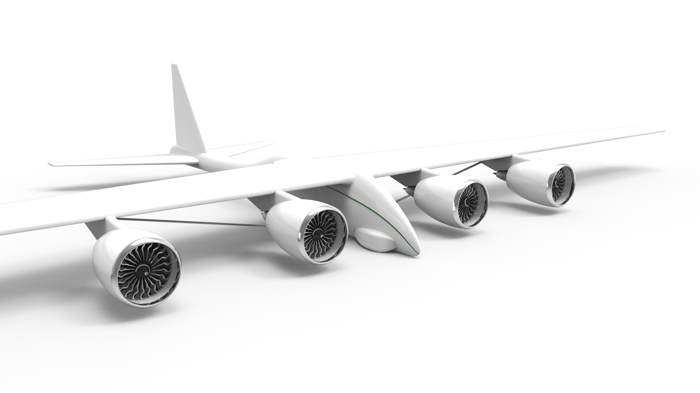

# SUAVE model for geoengineering aircraft

SAGA or Stratospheric Aerosol Geoengineering Aircraft project is a feasibility study of a fleet of aircraft designed to temporarily mitigate the effects of global warming. Program proposes a fleet of purpose-built aircraft to deliver 5MT of aerosol per year to altitudes between 18.5 and 19.5 km. To accommodate and appropriately investigate the requirements posed by the very unconventional SAGA mission, Stanford University Aerospace Vehicle Environment (SUAVE) is used for performance analysis in lieu of conventional methods. 

[Final design report](SAGA_FinalDesignReport.pdf)
===================
 

Can aircraft delivery of stratospheric aerosol help save the climate?
====================
Global warming is advancing faster than models from just a decade ago predicted. Uncurbed emissions of greenhouse gases might lead to positive feedback effects that are impossible to halt. The efforts to stop global warming focus on solving the problem in the long term. We are making progress, but the response is slow and we might not be fast enough. The possibility of unacceptable temperature increase before long-term solutions become effective might require a temporary intervention to manage global temperatures.
One possible approach is injection of aerosols into the stratosphere to reflect back a portion of the incoming sunlight. The Stratospheric Aerosol Geoengineering Aircraft (SAGA) program proposes a fleet of purpose-built aircraft to deliver 5MT of aerosol per year to altitudes between 18.5 and 19.5 km. SAGA operates a fleet of nearly 350 aircraft, flying twice per day with a 35-ton payload. For optimal aerosol effectiveness, the injection will take place in the tropical region where seven airports will be adapted for SAGA operations. Derived from the natural analogue of volcanic activity, the aerosol consists of sulfuric acid, which brings about an albedo-enhancing effect.

The constraints of the SAGA mission lead to an extremely narrow design space, with aspect ratio, thrust, structural weight and aeroelasticity as major design drivers. To meet the requirements, we developed a complete performance model using the Stanford University Aerospace Vehicle Environment (SUAVE) and SU2. This allowed us to augment relevant correlations with physics-based methods and automatically optimise the design. The final product features a massive, but lightweight 700m2 wing with an aspect ratio of 13. The unprecedented 95m wingspan is achieved with the help of a strut-braced wing design. Finally, four in-house-developed engines provide SAGA with over 2.5MN of thrust at sea level.

Aerosol-injection carries potentially adverse environmental effects, such as sulfuric acid deposition in precipitation and surface water. SAGA’s use is only justified if we exceed a critical temperature threshold and these effects can be balanced out with global warming mitigation potential. The aerosol in the stratosphere is estimated to reduce solar influx to counteract a 25% increase in CO2 concentration while the increase in atmospheric sulfur concentration is limited to 4%. In combination with its contribution to worldwide fuel consumption of only 0.03%, SAGA offers an environmentally viable bridge to limit global warming while a long-term, sustainable solution is implemented.
